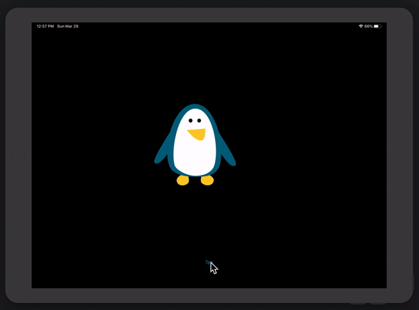

# Animation

  

 
iOS animation demonstration.

## Examples within this code
- animation(withDuration:)
- Spring animation
- Alpha values
- CGAffineTransform

## Demonstration
Small demonstration as to what the animations do when on a device.
 

